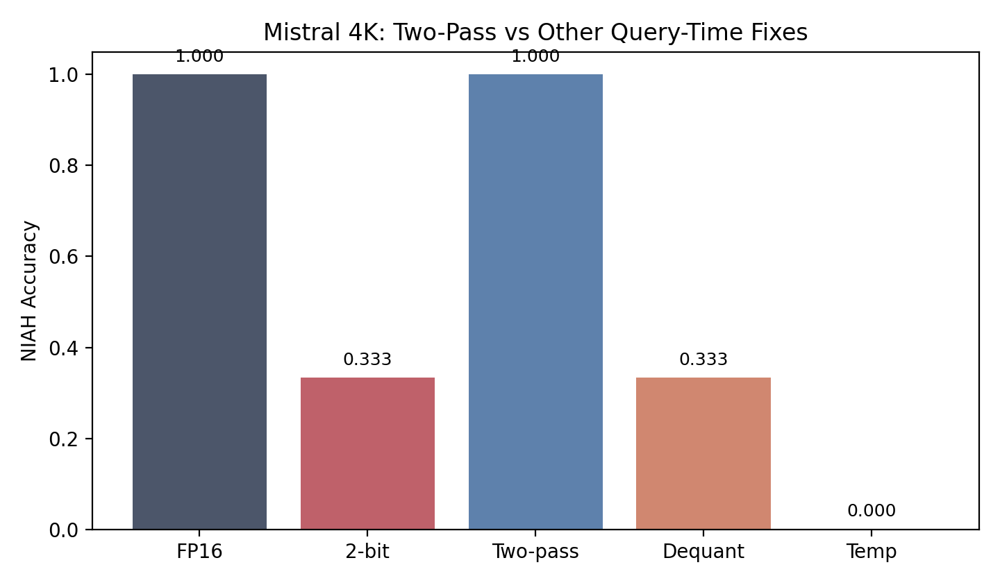
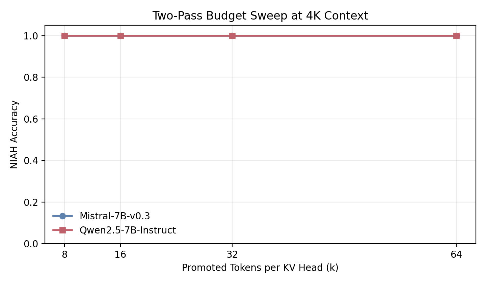

# Selective Refinement Report (2026-04-09)

## Executive Summary

이번 wave의 목적은 low-bit KV cache에서 retrieval failure를 가장 직접적으로 복구하는 query-time intervention을 찾는 것이었다. 결론은 단순하다. `two_pass`만 살아남았고, `query_dequant`, `sharp_temp`, 원래 형태의 `QDRP`, 그리고 `TRIC`은 현재 근거로는 더 밀 수 없다.

Mistral 4K same-harness 결과에서 `baseline_2bit` NIAH는 `0.333`이었고, `two_pass_k16`은 `1.000`이었다. 같은 조건에서 `query_dequant`의 최고값은 `0.333`, `sharp_temp`는 전부 `0.000`이었다. Qwen 4K에서도 `two_pass_k8/k16/k32/k64`가 모두 `1.000`으로 재현되었다. 이 결과는 “query-time repair가 된다”는 것보다 더 좁은 결론만 정당화한다. 지금 시점에서 정당한 claim은 “cache-correct two-pass selective refinement가 4K bounded NIAH에서 강한 retrieval recovery baseline으로 작동한다”는 정도다.

## 1. Intent

이번 실험의 의도는 저장량이 고정된 상태에서 decode-time computation만 바꿔 retrieval failure를 줄일 수 있는지를 확인하는 것이었다. 저장 방식을 다시 설계하는 방법이 아니라, 이미 저장된 low-bit cache를 query에 맞게 더 잘 읽는 방법을 찾는 것이 목표였다.

이 의도 아래에서 네 가지 후보가 있었다. 첫째는 proxy score 기반으로 일부 key만 다시 읽는 `two_pass`였다. 둘째는 query 방향으로 dequantization point를 bin 안에서 옮기는 `query_dequant`였다. 셋째는 quantization 때문에 flatten된 attention을 복구하겠다는 `sharp_temp`였다. 넷째는 원래 계획에서 더 크게 밀던 `QDRP`와 `TRIC`이었다. 이 둘은 이미 별도 진단에서 흔들리고 있었기 때문에 이번 wave에서는 “살릴 수 있는지”가 아니라 “정말 버려야 하는지”를 확인하는 성격이 강했다.

## 2. Fact Base

이번 보고서에서 쓰는 수치는 다음 파일로 검증했다.

1. `reports/autoresearch_query_exploit_log.tsv`
2. `reports/autoresearch_dynamic_recursive_log.tsv`
3. `reports/autoresearch_selective_refine_log.tsv`
4. `tmp_remote_results/mistral_all_methods_4k.json`
5. `tmp_remote_results/mistral_two_pass_4k.json`
6. `tmp_remote_results/qwen_two_pass_4k.json`
7. `reports/EXPERIMENT_PLAN_v27_dynamic_recursive.md`
8. `reports/EXPERIMENT_PLAN_v28_selective_refine.md`

이외의 해석은 모두 위 수치에서 직접 도출한 것이다.

## 3. Hypotheses and Outcomes

### H1. Query-time selective refinement는 retrieval failure를 복구할 수 있다

이 가설은 현재까지 지지된다. Mistral 4K에서 `two_pass_k8`, `k16`, `k32`, `k64`가 모두 `1.000`이었고, Qwen 4K에서도 같은 sweep이 모두 `1.000`이었다. Figure 1과 Figure 2는 각각 같은 조건에서 다른 method family와 비교한 결과, 그리고 `k` budget sweep 결과를 보여준다.

Figure 1은 same-harness 비교에서 `two_pass`만이 baseline을 확실하게 넘는다는 점을 보여준다. `baseline_2bit`가 `0.333`이고 `two_pass_k16`이 `1.000`인 반면, `query_dequant_s0.25`는 `0.333`에 머물렀고 `sharp_temp_t0.7`은 `0.000`이었다.

Figure 2는 현재 4K grid가 이미 포화되어 있음을 보여준다. 두 모델 모두 `k=8`부터 `1.000`에 도달하므로, 이 grid는 “작동 여부”는 말해 주지만 “최소 budget frontier”는 말해 주지 못한다.

### H2. Query-aware dequantization은 추가 저장 없이 retrieval을 개선할 수 있다

이 가설은 현재 실패다. Mistral 4K same-harness에서 `query_dequant_s0.1 = 0.000`, `query_dequant_s0.25 = 0.333`, `query_dequant_s0.5 = 0.000`이었다. 최고값이 baseline과 같은 수준에 머물렀으므로 현재 구현과 가설은 유지할 이유가 없다.

### H3. Temperature sharpening은 noise-induced flattening을 보상할 수 있다

이 가설도 실패다. `sharp_temp_t0.5`, `t0.7`, `t0.9`가 모두 `0.000`이었다. 따라서 이번 failure mode는 단순한 softmax temperature mismatch로 설명되지 않는다.

### H4. Risk-aware page selection은 raw score selection보다 낫다

synthetic에서는 부분적으로 맞았지만, real trace에서는 틀렸다. 기존 flip calibration 로그에서 Mistral 2-bit는 Recall@32 기준 `flip_risk = 0.7512`, `raw_score = 0.8017`이었고, Qwen 2-bit도 `flip_risk = 0.6648`, `raw_score = 0.6763`이었다. 따라서 원래 QDRP의 핵심 claim인 “real query-risk proxy가 raw score보다 낫다”는 문장은 지금 쓸 수 없다.

### H5. Tiny recursive innovation cache는 cross-layer predictor로 발전시킬 수 있다

이 가설은 아직 진단 단계에서 탈락했다. synthetic diagnostic에서 recursive predictor는 `copy-last`보다는 낫지만 shared linear baseline을 이기지 못했다. 현재 수치로는 `recursive_gain_vs_linear`이 음수로 남아 있어 원격 GPU를 더 쓸 이유가 없다.

## 4. What Actually Changed

이번 round에서 바뀐 점은 결과보다 해석이다. 처음에는 `QDRP`와 `TRIC`이 양대 축처럼 보였지만, real trace와 remote NIAH를 붙여 보니 살아남는 건 사실상 하나뿐이었다. 즉, “query-aware”라는 말 자체가 강한 것이 아니고, 실제로 retrieval을 회복하는 intervention만이 남았다.

`two_pass`가 살아남은 이유도 과장할 필요가 없다. 이 방법은 high-level idea만 보면 새로워 보이지 않는다. 하지만 cache-correct path 위에서 full cached KV length를 대상으로 selection을 하고, same-harness로 `baseline_2bit`, `query_dequant`, `sharp_temp`를 동시에 눌렀다는 점은 실질적이다. 반대로 이 결과만으로 novelty를 크게 주장하면 바로 공격받는다. 현재 상태에서 더 중요한 질문은 “왜 이게 되는가”이지 “이름을 무엇으로 붙일까”가 아니다.

## 5. Alternative Explanations That Still Need to Be Ruled Out

현재 결과는 강하지만, 다음 설명들을 아직 배제하지 못했다.

첫째, attention sink 또는 recency artifact일 가능성이다. `two_pass`가 실제 needle region을 잡는 것이 아니라, query 바로 앞 토큰이나 sink token을 과하게 올려서 우연히 binary success를 만들었을 수도 있다.

둘째, 현재 4K grid가 너무 쉬운 cliff task일 가능성이다. `k=8`부터 모두 `1.000`이므로, 이 결과만으로는 real budget frontier를 말할 수 없다.

셋째, equal-budget objection이다. `two_pass`는 선택된 위치에 대해 사실상 higher-precision key를 다시 읽는다. 따라서 equal-storage, equal-HBM, equal-extra-compute를 분리하지 않으면 리뷰어는 budget cheating이라고 볼 것이다.

넷째, binary NIAH 특유의 winner-take-all artifact다. 현재는 top-1 success만 보기 때문에 실제로 ranking 전체가 회복됐는지, 아니면 취약한 margin 하나만 뒤집혔는지 구분되지 않는다.

## 6. Strongest Current Conclusion

지금 가장 강한 문장은 다음 하나다.

“4K bounded NIAH에서 cache-correct two-pass selective refinement는 same-harness 2-bit baseline보다 훨씬 강하고, query-aware dequantization과 temperature sharpening은 같은 조건에서 실패했다.”

이보다 큰 claim은 아직 시기상조다. 특히 `QDRP`를 real risk-aware theory로 되살리거나, `two_pass`를 완성된 paper idea로 부르기에는 아직 구멍이 남아 있다.

## 7. Next Plan

다음 실험은 셋으로 좁힌다.

첫째, `two_pass`가 실제로 needle page를 잡는지 확인하는 selector diagnostic이다. 선택된 index의 recency 분포, sink overlap, needle overlap, 그리고 simple `recent_k`/`sink_k` control을 같은 prompt에서 비교해야 한다.

둘째, harder budget frontier를 찾는 실험이다. 4K 포화 grid를 버리고 8K 또는 16K에서 `k=1,2,4,8,16`으로 내려가야 한다.

셋째, fair-budget table이다. `2-bit + selective FP16 fetch`, `uniform 3-bit`, `selective stored 3-bit refinement`를 분리해서 적어야 한다. 이 표가 없으면 방법이 작동해도 리뷰 단계에서 방어가 어렵다.

## 8. Decision Table

| Direction | Current status | Reason |
|-----------|----------------|--------|
| `two_pass` | Keep | same-harness NIAH recovery is strong on Mistral and Qwen |
| `query_dequant` | Drop for now | no gain over baseline on the bounded 4K grid |
| `sharp_temp` | Drop | all tested temperatures failed |
| `QDRP` | Diagnostic only | real flip-risk proxy loses to raw score |
| `TRIC` | Drop for now | recursive predictor still loses to shared linear baseline |

## 9. Files Produced in This Wave

1. `scripts/exp_query_exploit.py`
2. `reports/autoresearch_query_exploit_log.tsv`
3. `reports/figures/selective_refine_mistral_method_compare.png`
4. `reports/figures/selective_refine_two_pass_budget_sweep.png`
5. `tmp_remote_results/mistral_all_methods_4k.json`
6. `tmp_remote_results/mistral_two_pass_4k.json`
7. `tmp_remote_results/qwen_two_pass_4k.json`
